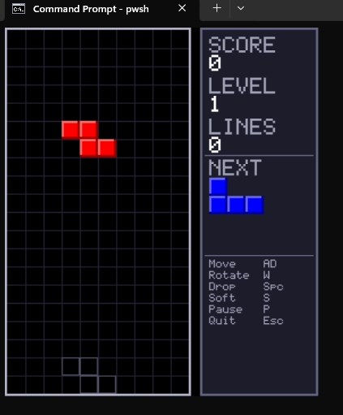

# PSTetris

A fully playable Tetris game that runs directly in your PowerShell console. Supports both classic ANSI text rendering and high-quality Sixel pixel graphics for modern terminals.



## Features

- Classic Tetris gameplay on a 10x20 board
- Dual rendering modes: ANSI text and Sixel pixel graphics
- Ghost piece (shows where the active piece will land)
- Next-piece preview
- Score, level, and lines tracking with speed progression
- Wall-kick rotation system
- Pause and quit support

## Requirements

- PowerShell 5.1 or PowerShell 7+
- An interactive console (not PowerShell ISE or a redirected session)
- For Sixel graphics: a Sixel-capable terminal (mlterm, mintty, foot, WezTerm, Contour)

## Installation

### From the PowerShell Gallery

```powershell
Install-Module -Name PSTetris
```

To install for the current user only (no admin rights required):

```powershell
Install-Module -Name PSTetris -Scope CurrentUser
```

Verify the installation:

```powershell
Get-Module -ListAvailable -Name PSTetris
```

### Manual installation (from source)

See [CONTRIBUTING.md](CONTRIBUTING.md) for build instructions.

## Quick Start

After installing, run:

```powershell
Start-Tetris
```

The renderer is selected automatically. If your terminal supports Sixel graphics it uses the pixel renderer; otherwise it falls back to ANSI text.

### Forcing a renderer

```powershell
Start-Tetris -Renderer ansi    # Always use ANSI text
Start-Tetris -Renderer sixel   # Always use Sixel graphics
Start-Tetris -Renderer auto    # Auto-detect (default)
```

## Controls

| Key | Action |
|-----|--------|
| `←` / `A` | Move left |
| `→` / `D` | Move right |
| `↑` / `W` | Rotate clockwise |
| `Z` or `X` | Rotate counter-clockwise |
| `↓` / `S` | Soft drop (+1 point per cell) |
| `Space` | Hard drop (+2 points per cell) |
| `P` | Pause / Resume |
| `Esc` / `Q` | Quit |

## Scoring

| Lines cleared at once | Points |
|-----------------------|--------|
| 1 (Single) | 100 × level |
| 2 (Double) | 300 × level |
| 3 (Triple) | 500 × level |
| 4 (Tetris) | 800 × level |
| Soft drop | 1 per cell |
| Hard drop | 2 per cell |

## Difficulty

The game speeds up as you clear lines:

| Level | Lines cleared | Fall interval |
|-------|---------------|---------------|
| 1 | 0–9 | 800 ms |
| 2 | 10–19 | 730 ms |
| 5 | 40–49 | 520 ms |
| 10 | 90–99 | 170 ms |
| 11+ | 100+ | 80 ms (maximum) |

Level = `(total lines ÷ 10) + 1`. Maximum speed is reached at level 11.

## Rendering Modes

### ANSI (default fallback)

Works in any terminal that supports ANSI color codes — including Windows Terminal, ConEmu, and standard Linux/macOS terminals. Each cell is rendered as two Unicode block characters with bright colors.

### Sixel

Rendered as true pixel graphics using the [Sixel](https://en.wikipedia.org/wiki/Sixel) terminal graphics protocol. Requires a Sixel-capable terminal:

- [mlterm](http://mlterm.sourceforge.net/)
- [mintty](https://mintty.github.io/) (Git for Windows, Cygwin, WSL)
- [foot](https://codeberg.org/dnkl/foot)
- [WezTerm](https://wezfurlong.org/wezterm/)
- [Contour](https://github.com/contour-terminal/contour)

Terminal support is detected automatically via the `TERM_PROGRAM` environment variable and a DA1 (Device Attributes) probe.

## Documentation

- [How to Play](docs/how-to-play.md) — detailed gameplay guide
- [Architecture](docs/architecture.md) — technical deep-dive for contributors
- [Contributing](CONTRIBUTING.md) — build, test, and extend the project

## License

See [LICENSE](LICENSE).
